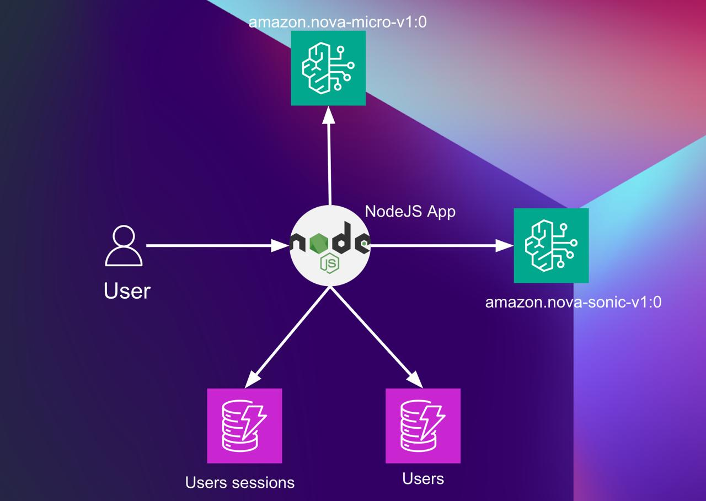
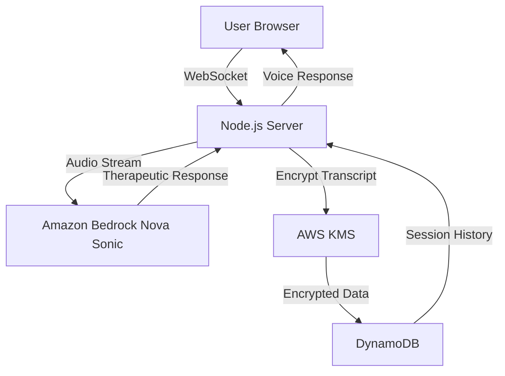

# Hope - AI Therapeutic Companion

**A compassionate AI assistant designed to support individuals experiencing mental health challenges through natural voice conversations.**

## What is Hope?

Hope is an AI-powered therapeutic companion built to provide a safe, non-judgmental space for people struggling with:

- **Post-Traumatic Stress Disorder (PTSD)** - Offering grounding techniques and emotional support
- **Depression and Anxiety** - Providing coping strategies and active listening
- **Social Isolation** - Helping those who find it difficult to open up to others
- **Emotional Processing** - Supporting users in expressing and understanding their feelings

## Who is this for?

This application is designed for individuals who:

- **Struggle to open up to others** - Hope provides a judgment-free environment to start sharing
- **Need immediate emotional support** - Available 24/7 when traditional therapy isn't accessible  
- **Want to practice expressing their feelings** - A safe space to work through emotions before speaking with humans
- **Benefit from consistent therapeutic support** - Hope remembers your journey and builds on previous conversations
- **Prefer voice-based interaction** - Natural speech feels more personal than text-based chat

## Key Therapeutic Features

### **Conversation Memory & Continuity**
- **Remembers your story** - Hope recalls your previous sessions and personal details
- **Builds on progress** - References past conversations to show growth and patterns
- **Personalized support** - Adapts responses based on your unique situation and needs

### **Evidence-Based Techniques**
- **Grounding exercises** - 5-4-3-2-1 technique and breathing exercises
- **Active listening** - Validates feelings and reflects back what you share
- **Psychoeducation** - Explains trauma responses and mental health concepts
- **Crisis support** - Provides immediate resources when needed

### **Safe & Private**
- **Encrypted conversations** - All session data is securely stored
- **Anonymous option** - Use without providing personal information
- **No judgment** - Designed to be patient, understanding, and supportive

## How Hope Helps

1. **Breaking the Silence** - For those who've never spoken about their trauma or feelings
2. **Consistent Support** - Available whenever you need someone to listen
3. **Skill Building** - Learn coping techniques and emotional regulation strategies
4. **Progress Tracking** - See your emotional journey over time
5. **Bridge to Human Care** - Builds confidence to eventually seek professional therapy

## Technical Implementation

This project implements a sophisticated bidirectional WebSocket-based audio streaming application that integrates with Amazon Nova Sonic model for real-time speech-to-speech therapeutic conversations. The application enables natural conversational interactions through a web interface while leveraging Amazon's powerful Nova Sonic model for processing and generating empathetic responses.

## AWS Services Architecture

### **Core AWS Services Integration:**
- ** Amazon Bedrock (Nova Sonic)** - Real-time speech-to-speech processing with therapeutic prompt engineering
- ** AWS KMS** - Enterprise-grade encryption for sensitive conversation transcripts
- ** Amazon DynamoDB** - Persistent session storage with conversation continuity
- ** AWS SDK** - Seamless integration across all services

### **Technical Architecture Flow:**
```
User Voice Input → WebSocket Server → Amazon Bedrock (Nova Sonic) → 
Therapeutic Response → KMS Encryption → DynamoDB Storage → 
Voice Output → User
```



## Amazon Bedrock Integration Highlights

### **Advanced Bedrock Features:**
- **Real-time Bidirectional Streaming** - Not just API calls, but continuous conversation flow
- **Therapeutic Prompt Engineering** - Specialized prompts for PTSD, depression, and anxiety support
- **Context-Aware Responses** - Maintains conversation history and emotional state
- **Crisis Detection & Response** - Built-in safety protocols with immediate resource provision
- **Conversation Memory** - Persistent context across sessions using DynamoDB integration

### **Nova Sonic Model Capabilities:**
- **Voice-First Therapeutic Experience** - Natural speech processing optimized for emotional context
- **Empathetic Response Generation** - Trained responses for mental health support scenarios
- **Real-time Audio Processing** - Low-latency speech-to-speech for natural conversation flow
- **Emotional Tone Recognition** - Adapts responses based on user's emotional state
- **Therapeutic Technique Integration** - Delivers grounding exercises and coping strategies through voice

### **Production-Ready Implementation:**
- **Error Handling & Fallbacks** - Graceful degradation when services are unavailable
- **Scalable WebSocket Architecture** - Supports multiple concurrent therapeutic sessions
- **Security-First Design** - All sensitive data encrypted with AWS KMS before storage
- **Conversation Continuity** - Seamless session management across user interactions

## Repository Structure
```
.
├── public/                 # Frontend web application files
│   ├── index.html          # Main application entry point
│   └── src/                # Frontend source code
│       ├── lib/            # Core frontend libraries
│       │   ├── play/       # Audio playback components
│       │   └── util/       # Utility functions and managers
│       ├── main.js         # Main application logic
│       └── style.css       # Application styling
├── src/                    # TypeScript source files
│   ├── client.ts           # AWS Bedrock client implementation
│   ├── server.ts           # Express server implementation
│   └── types.ts            # TypeScript type definitions
└── tsconfig.json           # TypeScript configuration
```

## Usage Instructions

### Prerequisites
- Node.js (v14 or higher)
- AWS Account with Bedrock access
  - `amazon.nova-micro-v1:0` model
  - `amazon.nova-sonic-v1:0` model
- AWS CLI configured with appropriate credentials
- Modern web browser with WebAudio API support


### Installation
1. Clone the repository:
```bash
git clone https://github.com/tokarev-artem/Hope-the-therapist.git
cd Hope-the-therapist
```

2. Install dependencies:
```bash
npm install
```

3a. Configure AWS credentials to test it locally:
```bash
# Configure AWS CLI with your credentials
export AWS_ACCESS_KEY_ID=""
export AWS_SECRET_ACCESS_KEY=""
export AWS_SESSION_TOKEN=""
```
3b. Configure AWS service role to run in AWS. Don't forget to edit your account id and kms key id. The key we will create in step 5
```
{
    "Version": "2012-10-17",
    "Statement": [
        {
            "Sid": "bedrock",
            "Effect": "Allow",
            "Action": [
                "bedrock:InvokeModel"
            ],
            "Resource": [
                "*"
            ]
        },
        {
            "Sid": "dynamodb",
            "Effect": "Allow",
            "Action": [
                "dynamodb:GetItem",
                "dynamodb:PutItem",
                "dynamodb:UpdateItem"
            ],
            "Resource": [
                "arn:aws:dynamodb:us-east-1:<account_id>>:table/therapeutic-wave-sessions",
                "arn:aws:dynamodb:us-east-1:<account_id>:table/therapeutic-wave-users"
            ]
        },
        {
            "Sid": "dynamodbindex",
            "Effect": "Allow",
            "Action": [
                "dynamodb:Query"
            ],
            "Resource": [
                "arn:aws:dynamodb:us-east-1:<account_id>:table/therapeutic-wave-sessions/index/userId-startTime-index"
            ]
        },
        {
            "Sid": "kms",
            "Effect": "Allow",
            "Action": [
                "kms:Encrypt",
                "kms:Decrypt"
            ],
            "Resource": [
                "arn:aws:kms:us-east-1:<account_id>:key/<key_id>"
            ]
        }
    ]
}
```
4. Create .env file 
```
$ cp .env.example .env
```

5. Create a KMS key for transcript encryption:
```bash
# Create a KMS key for encrypting therapeutic conversation transcripts
aws kms create-key \
    --description "Hope AI Therapeutic Transcript Encryption Key" \
    --key-usage ENCRYPT_DECRYPT \
    --key-spec SYMMETRIC_DEFAULT \
    --region us-east-1
```

Copy the `KeyId` from the response and add it to your `.env` file:
```bash
KMS_KEY_ID=your-kms-key-id-here
```

**Note**: KMS encryption provides enterprise-grade security for sensitive therapeutic conversations. If no KMS key is provided, the application will fall back to local encryption for demo purposes.

6. Create DynamoDB tables:

**Users Table:**
```bash
aws dynamodb create-table \
  --table-name therapeutic-wave-users \
  --attribute-definitions \
    AttributeName=userId,AttributeType=S \
    AttributeName=isAnonymous,AttributeType=S \
    AttributeName=lastActiveAt,AttributeType=S \
  --key-schema AttributeName=userId,KeyType=HASH \
  --global-secondary-indexes '[
    {
      "IndexName": "isAnonymous-lastActiveAt-index",
      "KeySchema": [
        {"AttributeName":"isAnonymous","KeyType":"HASH"},
        {"AttributeName":"lastActiveAt","KeyType":"RANGE"}
      ],
      "Projection": {"ProjectionType":"ALL"}
    }
  ]' \
  --billing-mode PAY_PER_REQUEST \
  --region us-east-1

```

**Sessions Table:**
```bash
aws dynamodb create-table \
  --table-name therapeutic-wave-sessions \
  --attribute-definitions \
    AttributeName=sessionId,AttributeType=S \
    AttributeName=GSI1PK,AttributeType=S \
    AttributeName=GSI1SK,AttributeType=S \
  --key-schema AttributeName=sessionId,KeyType=HASH \
  --global-secondary-indexes '[
    {
      "IndexName": "userId-startTime-index",
      "KeySchema": [
        {"AttributeName":"GSI1PK","KeyType":"HASH"},
        {"AttributeName":"GSI1SK","KeyType":"RANGE"}
      ],
      "Projection": {"ProjectionType":"ALL"}
    }
  ]' \
  --billing-mode PAY_PER_REQUEST \
  --region us-east-1

```

6. Build the TypeScript code:
```bash
npm run build
```

### Quick Start
1. Start the server:
```bash
npm start
```

2. Open your browser:
```
http://localhost:3000
```

3. **Enter your name** (or remain anonymous) and begin your therapeutic journey
4. **Grant microphone permissions** when prompted
5. **Start speaking** - Hope will listen and respond with voice and understanding

## Demo & Examples

### **Live Demo Experience**
Experience Hope's therapeutic capabilities:
1. **Natural Conversation Flow** - "Hello Hope, I'm feeling anxious today"
2. **Memory & Continuity** - "How have things been since we talked about your work stress, Sarah?"
3. **Therapeutic Techniques** - "Let's try a grounding exercise. Name 5 things you can see around you..."
4. **Crisis Support** - Immediate resources and professional help guidance when needed

### **Sample Conversation Scenarios**
- **First-time User**: Gentle introduction and rapport building
- **Returning User**: References previous sessions and emotional progress
- **Crisis Situation**: Immediate support with professional resource recommendations
- **Coping Techniques**: Guided breathing exercises and grounding techniques

## 🗣️ How to Use Hope

### **First Time Users**
1. **Introduce yourself** - Share your name or stay anonymous
2. **Start simple** - "Hello" or "I'm having a difficult day"
3. **Take your time** - Hope is patient and won't rush you
4. **Be honest** - Share what feels comfortable

### **Returning Users**
- Hope will **remember you** and reference previous conversations
- Ask **"What did we talk about before?"** to continue where you left off
- Hope tracks your **emotional journey** and progress over time

### **During Conversations**
- **Speak naturally** - No special commands needed
- **Take pauses** - Hope understands silence and processing time
- **Ask for help** - "Can you help me calm down?" or "I need grounding techniques"
- **Set boundaries** - "I don't want to talk about that today"

## Data Flow
The application processes audio input through a pipeline that converts speech to text, processes it with AWS Bedrock, and returns both text and audio responses.

```ascii
User Speech -> Browser → Server → Client
     ↑                               ↓
     │                   Amazon Nova Sonic Model
     │                               ↓
Audio Output ← Browser ← Server ← Client
```

Key flow components:
1. User speaks into the microphone through Browser
2. Audio is streamed through Server to Client
3. Client sends audio to Amazon Nova Sonic Model
4. Nova Sonic processes audio and generates AI response
5. Response is sent back through client to server to browser
6. Browser plays audio response to user


## ⚠️ Important Disclaimers

**Hope is not a replacement for professional mental health care.** This AI assistant:

- **Provides supportive listening** and evidence-based coping techniques
- **Offers crisis resources** and encourages professional help when needed
- **Creates a safe space** for emotional expression and processing
- **Does not diagnose** mental health conditions
- **Does not provide therapy** or clinical treatment
- **Cannot replace** licensed mental health professionals

**If you're experiencing thoughts of self-harm or suicide, please contact:**
- **Crisis Text Line**: Text HOME to 741741
- **National Suicide Prevention Lifeline**: 988
- **Emergency Services**: 911

## 🎭 Therapeutic Approach

Hope is designed with trauma-informed principles:

- **Safety First** - User safety is the top priority in all interactions
- **Validation** - All feelings and experiences are acknowledged and validated
- **Empowerment** - Focus on user strengths and ability to cope
- **Patience** - No rushing to solutions; users guide the conversation
- **Boundaries** - Clear limits on what Hope can and cannot provide

## Database Structure
The application uses DynamoDB to store user data and session information:

### Tables
- **therapeutic-wave-users**: Stores user profiles, preferences, and metadata
- **therapeutic-wave-sessions**: Stores individual therapy sessions with conversation data

### Key Features
- **AWS KMS encrypted conversation transcripts** for maximum security
- **Session continuity** and user recognition
- **Emotional state tracking** and progress monitoring
- **Secure user identification** with UUID-based system
- **Enterprise-grade encryption** for therapeutic data

## 🔐 Security & Privacy

### **Enterprise-Grade Encryption**
- **AWS KMS Integration** - Therapeutic conversation transcripts are encrypted using AWS Key Management Service
- **Encryption Context** - Each transcript includes metadata for audit trails and access control
- **Key Rotation** - Supports automatic key rotation for enhanced security
- **Fallback Protection** - Graceful fallback to local encryption if KMS is unavailable

### **Data Protection**
- **PII Sanitization** - Automatically removes email addresses, phone numbers, and other sensitive data
- **Secure Storage** - All user data encrypted at rest in DynamoDB
- **Access Control** - KMS policies control who can decrypt therapeutic conversations
- **Audit Trails** - Complete logging of encryption/decryption operations

### **Compliance Ready**
- **HIPAA Considerations** - KMS encryption supports healthcare compliance requirements
- **Data Residency** - Control data location through AWS region selection
- **Retention Policies** - Configurable data retention for regulatory compliance

## 📊 Bedrock Model Configuration

### **Therapeutic Prompt Engineering**
Hope uses specialized prompts optimized for mental health support:

```javascript
// Example therapeutic system prompt structure
{
  role: "Hope - Compassionate AI Therapeutic Companion",
  principles: [
    "Safety First - User safety is top priority",
    "Validation - Always validate user feelings",
    "Empowerment - Focus on user strengths",
    "Patience - Allow user to guide conversation"
  ],
  techniques: [
    "Grounding exercises (5-4-3-2-1 technique)",
    "Breathing techniques (box breathing)",
    "Active listening and reflection",
    "Crisis resource provision"
  ]
}
```

### **Nova Sonic Optimization**
- **Low-latency streaming** for natural conversation flow
- **Emotional tone adaptation** based on user's speech patterns
- **Context preservation** across conversation turns
- **Therapeutic response generation** with evidence-based techniques

## 🏗️ Infrastructure & Deployment

### **Core Technology Stack**
- **Node.js + TypeScript** - Type-safe server implementation
- **Express.js + Socket.IO** - Real-time WebSocket communication
- **Amazon Bedrock SDK** - Nova Sonic model integration
- **AWS SDK v3** - KMS and DynamoDB integration
- **Modern Web Audio API** - Browser-based audio processing

### **AWS Services Integration**


### **Scalability & Performance**
- **Concurrent Sessions** - Supports multiple users simultaneously
- **Real-time Processing** - Sub-second response times with Nova Sonic
- **Persistent Memory** - Conversation continuity across sessions
- **Error Recovery** - Graceful handling of service interruptions

### **Production Considerations**
- **Environment Configuration** - Separate dev/staging/production configs
- **Monitoring & Logging** - Comprehensive error tracking and performance metrics
- **Security Headers** - CORS, CSP, and other security best practices
- **Health Checks** - Database and service connectivity monitoring
