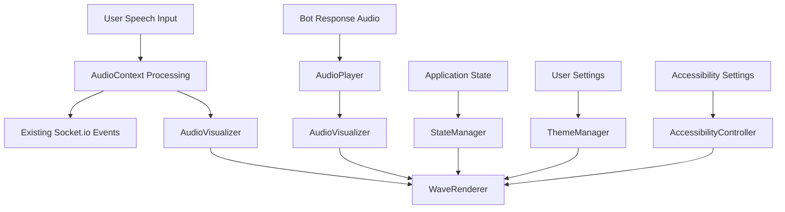

# Design Document

## Overview

The therapeutic wave interface will replace the existing chat-based UI with a calming, wave-based visual animation system specifically designed for users with PTSD. The design maintains all existing speech-to-speech functionality while providing a more therapeutic visual experience through smooth, responsive wave animations that react to both user input and bot responses.

The interface will use HTML5 Canvas with Web Audio API integration to create real-time visual feedback that responds to audio amplitude and frequency data. The design prioritizes smooth transitions, calming colors, and accessibility features to create a safe, non-triggering environment.

## Architecture

### Component Structure

```
WaveInterface/
├── WaveRenderer (Canvas-based wave visualization)
├── AudioVisualizer (Audio analysis and wave data processing)
├── StateManager (Animation state transitions)
├── ThemeManager (Color palettes and visual customization)
├── AccessibilityController (Motion sensitivity and customization)
└── IntegrationLayer (Connection to existing speech-to-speech system)
```

### Integration with Existing System

The wave interface will integrate with the current architecture by:

1. **Replacing the Chat Container**: The `#chat-container` div will be replaced with a `#wave-container` containing the Canvas element
2. **Maintaining Socket.io Events**: All existing WebSocket event handlers will remain unchanged
3. **Audio Processing Integration**: The wave animations will tap into the existing audio processing pipeline to get real-time amplitude and frequency data
4. **State Synchronization**: Wave animation states will sync with the existing application states (streaming, processing, ready, etc.)

### Data Flow



## Components and Interfaces

### WaveRenderer

**Purpose**: Core Canvas-based rendering engine for wave animations

**Key Methods**:
- `initialize(canvas: HTMLCanvasElement, config: WaveConfig): void`
- `render(waveData: WaveData, state: AnimationState): void`
- `updateTheme(theme: ThemeConfig): void`
- `resize(): void`

**Wave Types**:
- **Baseline Waves**: Gentle, slow-moving waves for idle state
- **Input Waves**: Responsive waves that react to user voice amplitude/frequency
- **Output Waves**: Distinct waves for bot speech with different visual characteristics
- **Transition Waves**: Smooth interpolation between different wave states

### AudioVisualizer

**Purpose**: Processes audio data and converts it to wave visualization parameters

**Key Methods**:
- `analyzeUserAudio(audioData: Float32Array): WaveData`
- `analyzeBotAudio(audioData: Float32Array): WaveData`
- `getBaselineWaveData(): WaveData`

**WaveData Interface**:
```typescript
interface WaveData {
  amplitude: number;        // 0-1 normalized amplitude
  frequency: number;        // Dominant frequency in Hz
  harmonics: number[];      // Harmonic content for wave complexity
  smoothedAmplitude: number; // Smoothed amplitude for stable animations
}
```

### StateManager

**Purpose**: Manages smooth transitions between different animation states

**Animation States**:
- `IDLE`: Baseline gentle waves
- `LISTENING`: User input responsive waves
- `PROCESSING`: Subtle processing indication waves
- `SPEAKING`: Bot output waves
- `ERROR`: Gentle error indication waves

**Key Methods**:
- `transitionTo(newState: AnimationState, duration: number): void`
- `getCurrentState(): AnimationState`
- `isTransitioning(): boolean`

### ThemeManager

**Purpose**: Manages color palettes and visual themes optimized for PTSD users

**Predefined Themes**:
- **Ocean Calm**: Soft blues and teals
- **Forest Peace**: Gentle greens and earth tones
- **Sunset Warmth**: Warm oranges and soft yellows
- **Moonlight Serenity**: Soft purples and silvers

**ThemeConfig Interface**:
```typescript
interface ThemeConfig {
  name: string;
  baselineColor: string;
  userInputColor: string;
  botOutputColor: string;
  backgroundColor: string;
  gradientStops: string[];
  opacity: number;
}
```

### AccessibilityController

**Purpose**: Provides customization options for users with different sensitivities

**Accessibility Options**:
- **Motion Intensity**: Scale factor for wave movement (0.1 - 1.0)
- **Color Contrast**: Adjust color intensity and contrast
- **Animation Speed**: Control transition and wave speeds
- **Reduced Motion**: Minimal movement mode for motion-sensitive users

## Data Models

### WaveConfig

```typescript
interface WaveConfig {
  canvas: {
    width: number;
    height: number;
    devicePixelRatio: number;
  };
  waves: {
    baselineAmplitude: number;
    maxAmplitude: number;
    frequency: number;
    waveCount: number;
    smoothingFactor: number;
  };
  animation: {
    frameRate: number;
    transitionDuration: number;
    easing: string;
  };
  theme: ThemeConfig;
  accessibility: AccessibilityConfig;
}
```

### AccessibilityConfig

```typescript
interface AccessibilityConfig {
  motionIntensity: number;    // 0.1 - 1.0
  colorIntensity: number;     // 0.1 - 1.0
  animationSpeed: number;     // 0.1 - 2.0
  reducedMotion: boolean;
  highContrast: boolean;
}
```

## Error Handling

### Visual Error Feedback

Instead of text-based error messages, the system will provide visual feedback through:

1. **Gentle Color Shifts**: Subtle shift to warmer colors to indicate issues
2. **Wave Pattern Changes**: Slightly different wave patterns to indicate different error types
3. **Smooth Degradation**: If performance issues occur, gracefully reduce animation complexity
4. **Fallback States**: Always maintain some level of visual feedback, even in error conditions

### Error Recovery

- **Audio Processing Errors**: Fall back to baseline waves while maintaining visual continuity
- **Canvas Rendering Errors**: Attempt to reinitialize canvas or fall back to simplified rendering
- **Performance Issues**: Automatically reduce animation complexity and frame rate


## Implementation Considerations

### Performance Optimization

- **RequestAnimationFrame**: Use for smooth 60fps animations
- **Canvas Optimization**: Implement efficient drawing techniques and avoid unnecessary redraws
- **Audio Processing**: Optimize FFT calculations and implement efficient smoothing algorithms
- **Memory Management**: Proper cleanup of audio contexts and canvas resources

### Browser Compatibility

- **Canvas Support**: Ensure compatibility with all modern browsers
- **Web Audio API**: Handle browser differences in audio processing
- **CSS Custom Properties**: Use for dynamic theming with fallbacks

### Responsive Design

- **Canvas Scaling**: Implement proper high-DPI display support
- **Mobile Optimization**: Optimize touch interactions and mobile performance
- **Flexible Layout**: Ensure wave interface works on various screen sizes and orientations

### Security and Privacy

- **Audio Data**: Ensure audio visualization data doesn't compromise user privacy
- **Local Storage**: Safely store user preferences and accessibility settings
- **Content Security Policy**: Ensure Canvas operations comply with CSP requirements