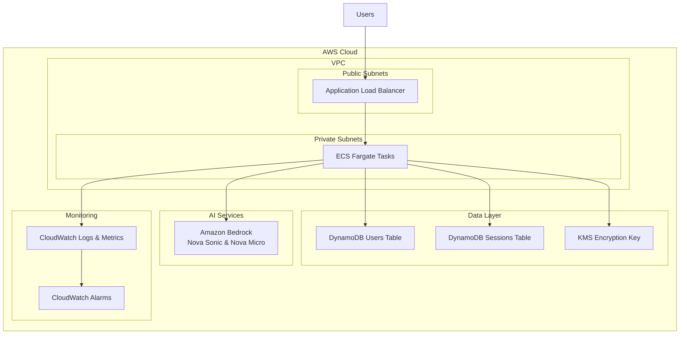

# Hope Therapeutic AI - Infrastructure

This directory contains the AWS CDK infrastructure code for deploying Hope, the AI Therapeutic Companion, to production.

## Architecture Overview



## Infrastructure Components

### **Compute & Networking**
- **VPC** - Multi-AZ with public/private subnets
- **ECS Fargate Cluster** - Serverless container hosting
- **Application Load Balancer** - With sticky sessions for WebSocket support
- **Auto Scaling** - CPU and memory-based scaling (2-20 instances)

### **Data Storage**
- **DynamoDB Users Table** - User profiles and preferences
- **DynamoDB Sessions Table** - Therapeutic session data with encryption
- **KMS Key** - Customer-managed encryption for therapeutic conversations

### **Security & Compliance**
- **IAM Roles** - Least privilege access for ECS tasks
- **VPC Security Groups** - Network-level security
- **KMS Encryption** - Enterprise-grade data protection
- **Private Subnets** - Application runs in private network

### **Monitoring & Observability**
- **CloudWatch Logs** - Centralized logging
- **CloudWatch Metrics** - Performance monitoring
- **CloudWatch Alarms** - Automated alerting
- **Container Insights** - ECS performance metrics

## Deployment Instructions

### Prerequisites

1. **AWS CLI configured** with appropriate permissions
2. **Node.js 18+** installed
3. **Docker** installed and running
4. **AWS CDK** permissions for your account

### Required AWS Permissions

Your AWS user/role needs these permissions:
```json
{
  "Version": "2012-10-17",
  "Statement": [
    {
      "Effect": "Allow",
      "Action": [
        "cloudformation:*",
        "ecs:*",
        "ec2:*",
        "elasticloadbalancing:*",
        "dynamodb:*",
        "kms:*",
        "iam:*",
        "logs:*",
        "cloudwatch:*",
        "route53:*",
        "certificatemanager:*"
      ],
      "Resource": "*"
    }
  ]
}
```

### Quick Deployment

1. **Run the deployment script:**
   ```bash
   ./deploy.sh
   ```

2. **Wait for deployment** (typically 10-15 minutes)

3. **Access your application** at the provided URL

### Manual Deployment Steps

If you prefer manual control:

1. **Install CDK dependencies:**
   ```bash
   cd infrastructure
   npm install
   cd ..
   ```

2. **Bootstrap CDK** (first time only):
   ```bash
   npx cdk bootstrap
   ```

3. **Build the application:**
   ```bash
   npm run build
   ```

4. **Deploy the stack:**
   ```bash
   npx cdk deploy HopeTherapeuticStack
   ```

## Configuration Options

### Environment Variables

Set these before deployment for customization:

```bash
export ENVIRONMENT=production        # Environment name
export AWS_REGION=us-east-1         # AWS region
export DOMAIN_NAME=yourdomain.com    # Optional: Custom domain
export CERTIFICATE_ARN=arn:aws:...   # Optional: SSL certificate
```

### Custom Domain Setup

To use a custom domain:

1. **Create/import SSL certificate** in AWS Certificate Manager
2. **Set environment variables:**
   ```bash
   export DOMAIN_NAME=hope.yourdomain.com
   export CERTIFICATE_ARN=arn:aws:acm:us-east-1:123456789012:certificate/12345678-1234-1234-1234-123456789012
   ```
3. **Deploy with custom domain:**
   ```bash
   npx cdk deploy HopeTherapeuticStack \
     --parameters domainName=hope.yourdomain.com \
     --parameters certificateArn=$CERTIFICATE_ARN
   ```

## Scaling Configuration

### Auto Scaling Settings
- **Minimum instances:** 2 (high availability)
- **Maximum instances:** 20 (handles high load)
- **CPU target:** 70% utilization
- **Memory target:** 80% utilization

### Scaling Triggers
- **Scale out:** When CPU > 70% or Memory > 80%
- **Scale in:** When CPU < 70% and Memory < 80%
- **Cool-down periods:** 2 min scale-out, 5 min scale-in

## Monitoring & Alerts

### CloudWatch Alarms
- **High CPU** (>85% for 2 periods)
- **High Memory** (>90% for 2 periods)
- **DynamoDB Throttling** (>5 throttled requests)

### Log Groups
- **Application logs:** `/ecs/hope-therapeutic`
- **Retention:** 30 days
- **Structured logging** with JSON format

## Security Features

### Network Security
- **Private subnets** for application containers
- **Security groups** with minimal required ports
- **NAT gateways** for outbound internet access

### Data Encryption
- **KMS customer-managed keys** for therapeutic data
- **Automatic key rotation** enabled
- **DynamoDB encryption** at rest and in transit

### Access Control
- **IAM roles** with least privilege
- **Resource-based policies** for fine-grained access
- **VPC endpoints** for AWS service communication

## Cost Optimization

### Resource Sizing
- **Fargate:** 1 vCPU, 2GB RAM per task
- **DynamoDB:** Pay-per-request billing
- **NAT Gateways:** 2 for high availability

### Estimated Monthly Costs
- **ECS Fargate:** ~$50-200 (2-20 instances)
- **Application Load Balancer:** ~$20
- **DynamoDB:** ~$10-50 (usage-based)
- **KMS:** ~$1 + usage
- **Data Transfer:** Variable
- **Total:** ~$80-300/month depending on usage

## Troubleshooting

### Common Issues

1. **Deployment fails with permissions error:**
   - Ensure your AWS user has required permissions
   - Check if CDK is bootstrapped: `npx cdk bootstrap`

2. **Service unhealthy:**
   - Check CloudWatch logs: `/ecs/hope-therapeutic`
   - Verify environment variables are set correctly
   - Ensure Bedrock models are available in your region

3. **WebSocket connections fail:**
   - Verify sticky sessions are enabled on ALB
   - Check security group allows port 3000
   - Confirm health check is passing

### Useful Commands

```bash
# View stack status
npx cdk list

# Check differences before deploy
npx cdk diff

# View CloudFormation template
npx cdk synth

# Destroy stack (careful!)
npx cdk destroy HopeTherapeuticStack

# View logs
aws logs tail /ecs/hope-therapeutic --follow

# Check service health
curl https://your-alb-url/health
```

## Cleanup

To remove all resources:

```bash
npx cdk destroy HopeTherapeuticStack
```

**⚠️ Warning:** This will delete all data including therapeutic conversations. Ensure you have backups if needed.

## Support

For deployment issues:
1. Check CloudWatch logs
2. Review CDK deployment output
3. Verify AWS permissions
4. Ensure all prerequisites are met